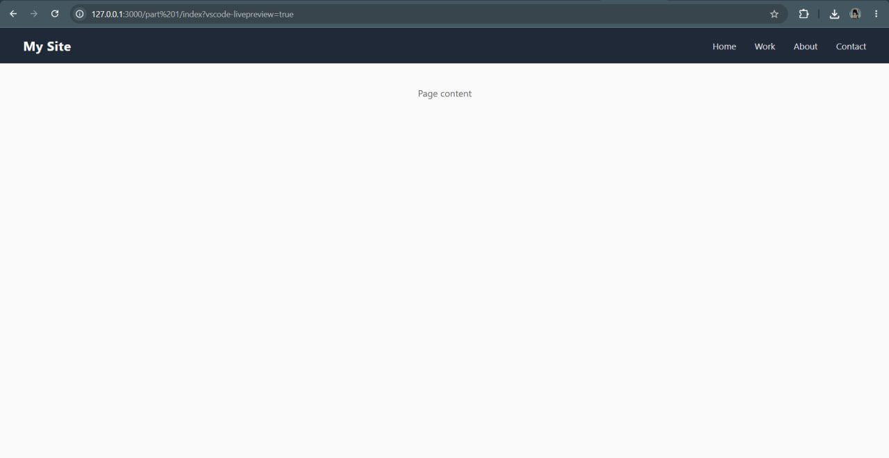
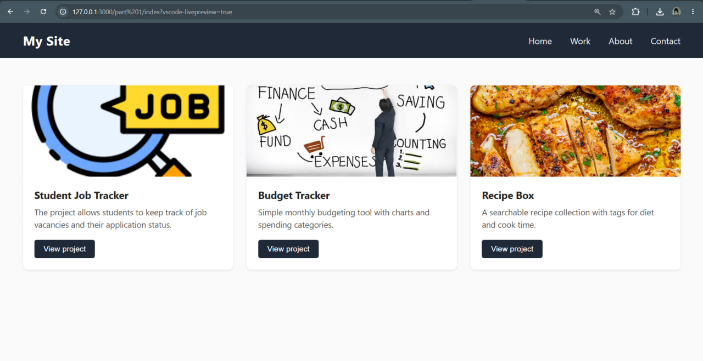
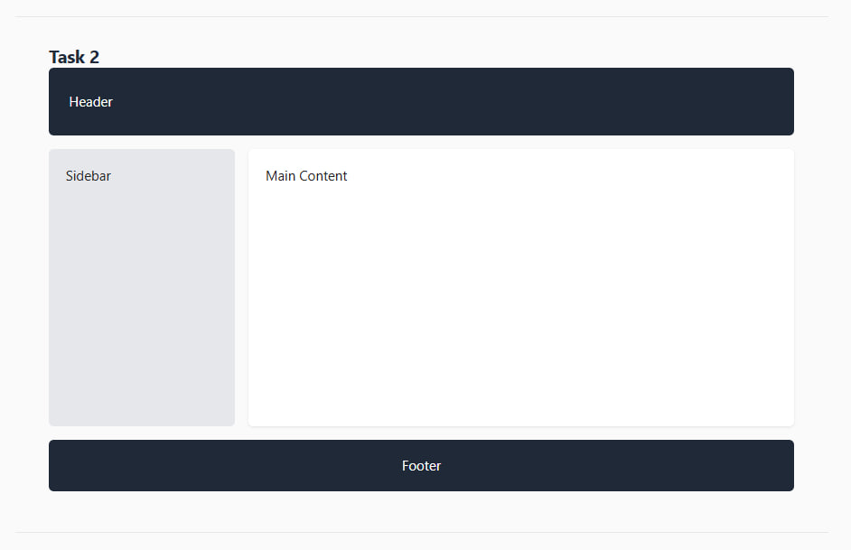
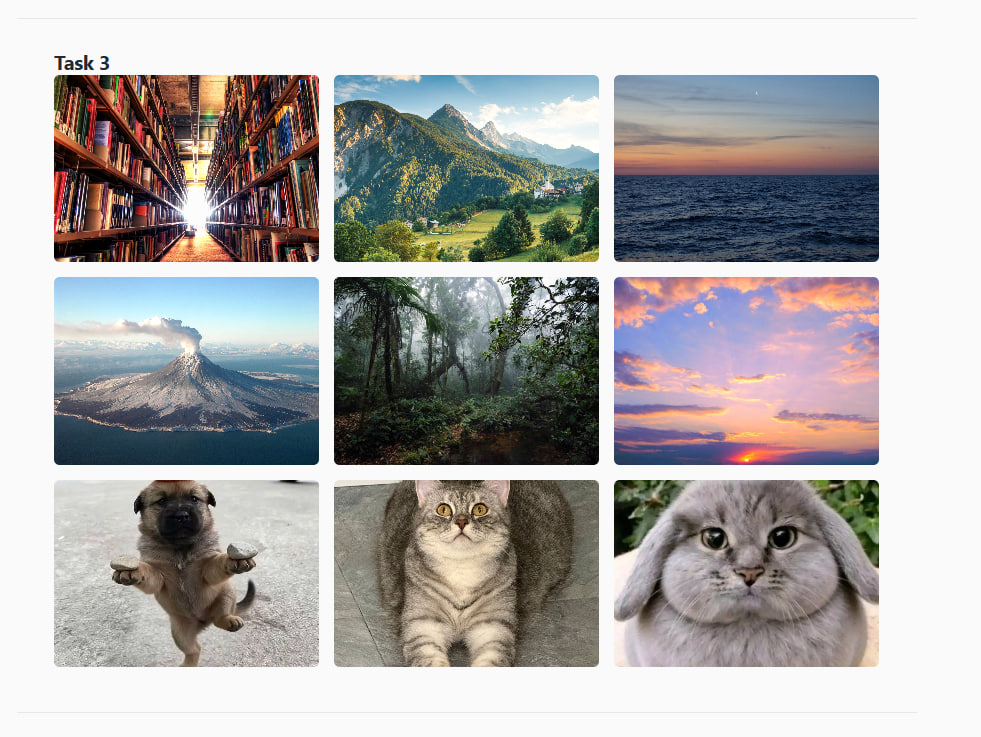
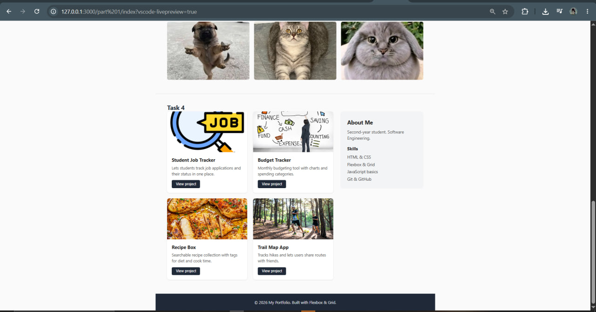

# FLEXBOX and Grid Lab

- ### Tleubay Abilmansur
- ### SE2540
- ### Live Site: https://pparalich.github.io/web_assignment-2/
- ### Repository: https://github.com/pParalich/web_assignment-2 

---
# Task 0
Create a header section with a logo on the left and a list of links on the right.

# Task 1
Created a card row and all 3 cards have equal height

# Task 2
A page layout built with CSS Grid: header on top, sidebar on the left, main content on the right, footer at the bottom — defined using grid-template-areas.

# Task 3
A 9-image gallery using CSS Grid with 3 equal columns, consistent gaps, and a caption overlay that appears on hover.

# Task 4
A final portfolio page combining both methods: Flexbox for the navigation and the content inside each project card, Grid for the "projects + sidebar" layout and overall page structure. The footer spans the full width of the page.

